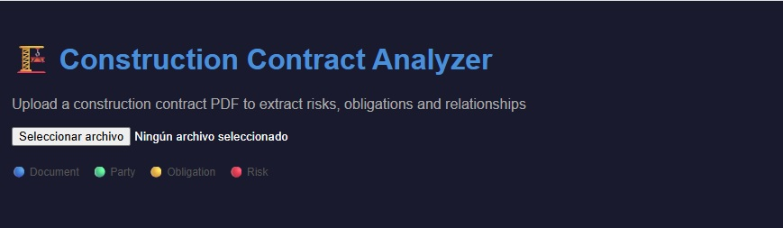
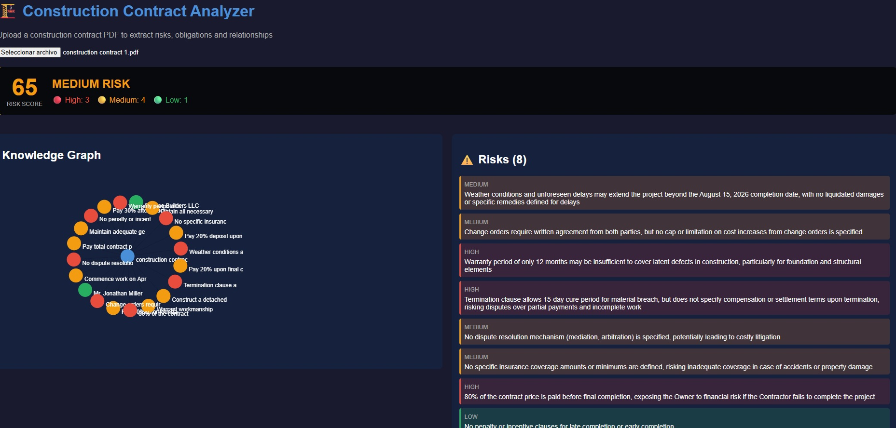
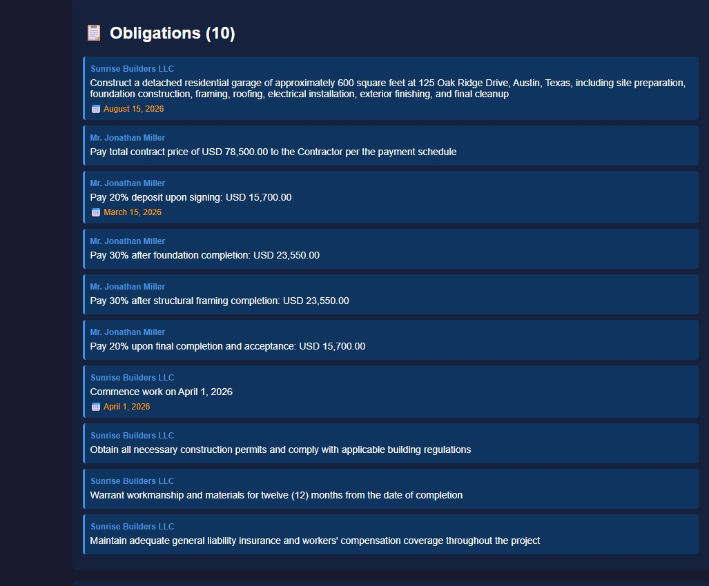
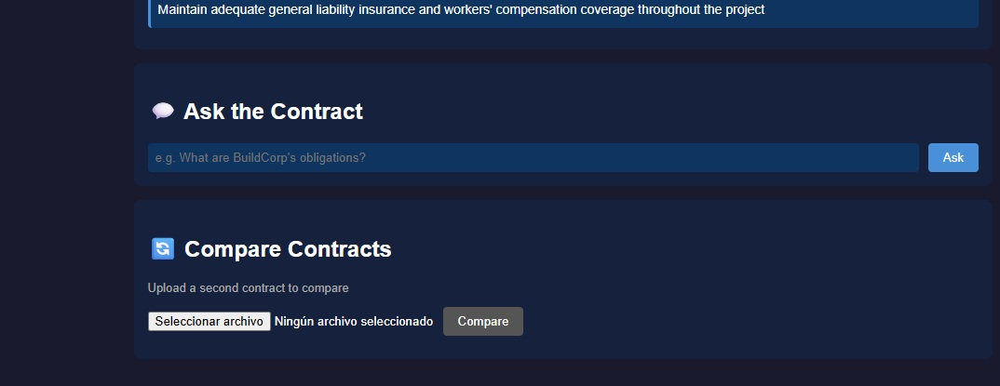
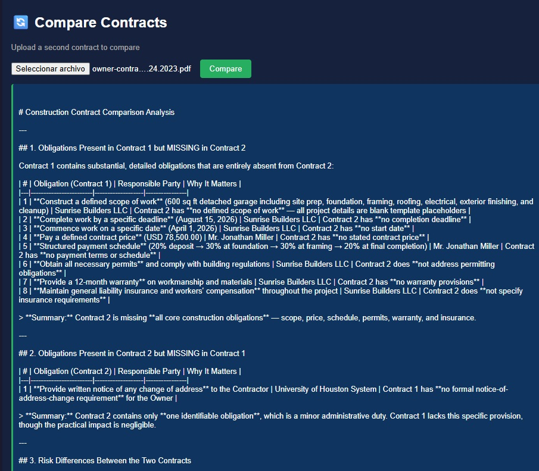
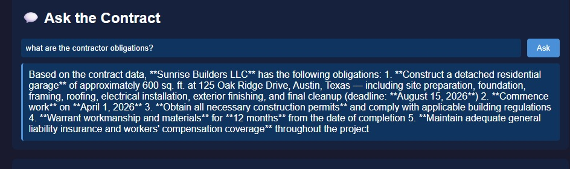

# 🏗️ Construction Contract Analyzer

> AI-powered Knowledge Graph system for analyzing construction contracts — built in one day as a technical demonstration.


## 🔗 Live Demo

| | URL |
|---|---|
| **Frontend** | https://enchanting-taiyaki-2a8f38.netlify.app |
| **API docs** | https://construction-kg-api-646458952332.europe-west1.run.app/docs |

---

## 📸 Screenshots

### Upload & analyze


### Risk score · Knowledge Graph · Risks


### Obligations by party


### Natural language query & contract comparison


### Comparison results


### Query results


---

## 🏛️ Architecture

```
PDF Contract
      ↓
Anthropic Claude (entity extraction via LLM)
      ↓
Neo4j AuraDB (Knowledge Graph — nodes, relationships)
      ↓
FastAPI on GCP Cloud Run (REST API)
      ↓
React + TypeScript on Netlify (visualization)
```
---

## ✨ Features

### 🔍 Entity extraction with LLM
Uploads a PDF contract and uses Claude to extract structured entities — parties, obligations, risks and clauses — with zero hardcoded rules.

### 🕸️ Knowledge Graph (Neo4j)
Stores extracted entities as a graph. Relationships between parties, obligations and risks enable complex queries impossible with flat databases.

### 📊 Risk scoring
Calculates an overall risk score (0–100) based on extracted risk severity. Classifies contracts as LOW / MEDIUM / HIGH RISK.

### 💬 Natural language query
Ask questions about the contract in plain English. The system retrieves context from the graph and generates accurate answers grounded in the document.

### 🔄 Contract comparison
Upload two contracts and get a structured comparison — obligations present in one but missing in the other, risk differences, and overall assessment.

---

## 🛠️ Tech Stack

| Technology | Role | Relevance to Volve |
|---|---|---|
| **Python 3.11** | Core language | Primary backend language |
| **Anthropic Claude** | LLM entity extraction | AI pipeline core |
| **Neo4j AuraDB** | Knowledge Graph storage | Document intelligence |
| **FastAPI** | REST API | Scalable Python backend |
| **React + TypeScript** | Frontend visualization | Web ↔ AI connection layer |
| **react-force-graph-2d** | Graph visualization | Knowledge Graph UI |
| **GCP Cloud Run** | API deployment | Cloud infrastructure |
| **Netlify** | Frontend deployment | Fast static hosting |
| **pytest** | Integration tests | Code quality & reliability |
| **PyPDF2** | PDF text extraction | Unstructured document processing |

---

## 🧪 Tests

7 integration tests covering all endpoints:

```bash
pytest test_api.py -v

test_api.py::test_health PASSED
test_api.py::test_get_obligations_existing_document PASSED
test_api.py::test_get_risks_existing_document PASSED
test_api.py::test_get_graph_existing_document PASSED
test_api.py::test_get_obligations_nonexistent_document PASSED
test_api.py::test_get_risks_nonexistent_document PASSED
test_api.py::test_analyze_invalid_file PASSED
```

---

## 🔌 API Endpoints

| Endpoint | Method | Description |
|---|---|---|
| `/analyze` | POST | Upload and analyze a contract PDF |
| `/graph/{name}` | GET | Knowledge Graph nodes and edges |
| `/obligations/{name}` | GET | Obligations by party with deadlines |
| `/risks/{name}` | GET | Risks with severity classification |
| `/risk-score/{name}` | GET | Overall risk score (0–100) |
| `/query` | POST | Natural language query over the graph |
| `/compare` | POST | Side-by-side contract comparison |

---

## 🚀 Local Setup

```bash
# Backend
python -m venv .venv
.venv\Scripts\activate
pip install -r requirements.txt
cp .env.example .env
uvicorn api:app --reload --port 8001

# Frontend
cd frontend
npm install
npm start
```

### Environment variables

```
NEO4J_URI=neo4j+s://your-instance.databases.neo4j.io
NEO4J_USERNAME=your-username
NEO4J_PASSWORD=your-password
NEO4J_DATABASE=your-database
ANTHROPIC_API_KEY=sk-ant-your-key
```

---

*Built in one day — June 2026*